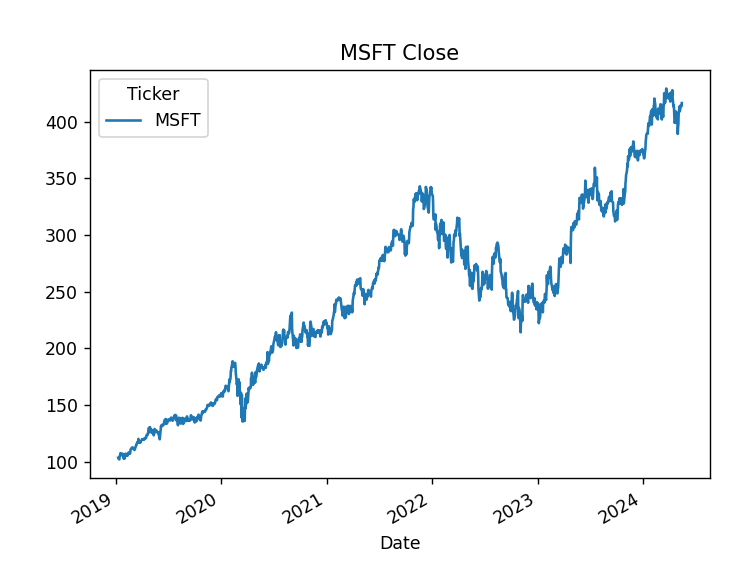

# DQN Applied to Optimal Trade Execution

This repository studies **optimal trade execution** using a **Deep Q-Network (DQN)** trained inside a simplified **Almgren–Chriss market impact model**, and benchmarks the learned strategy against classical execution schedules such as **TWAP**, **VWAP (proxy)**, and the **Almgren–Chriss analytical solution**.

---

## Data

Historical daily data for Microsoft (MSFT) from 2019–2024 is downloaded using `yfinance` and used to calibrate the execution environment.



From this dataset, three key parameters are estimated:

* **Permanent Impact (γ)** — estimated via regression of next-day returns on a trade-sign proxy.
* **Temporary Impact (η)** — estimated from intraday slippage (`Close − Open`).
* **Volatility (σ)** — computed from daily log-returns.

These parameters define the dynamics of the simulated execution market.

---

## Project Structure

| File         | Description                                                                                       |
| ------------ | ------------------------------------------------------------------------------------------------- |
| `Project.py` | Data download, parameter estimation, environment construction, and benchmark execution strategies |
| `DQN.py`     | Deep Q-Network agent with Prioritized Experience Replay and hyperparameter search                 |
| `figures/`   | Plots used for documentation (e.g., MSFT price visualization)                                     |

---

## Execution Model

A discrete-time execution environment inspired by the Almgren–Chriss framework is implemented.

### State

Each timestep is described by:

* `S` — Current mid-price
* `q` — Remaining inventory
* `t` — Time index

### Action Space

The agent selects one of **11 discrete execution intensities**:

```
{0%, 10%, 20%, ..., 100% of remaining inventory}
```

Each action determines the trading rate `v_t`.

---

## Market Dynamics

### Execution Price (Temporary Impact)

```
S_exec = S_t − η · v_t
```

### Mid-Price Evolution (Permanent Impact + Noise)

```
S_{t+1} = S_t + σ√Δt · ε − γ · v_t Δt
```

where `ε ~ N(0,1)` models stochastic market movement.

---

## Reward Function

The reward balances execution quality and market impact:

* Positive reward from executed revenue (scaled by initial price).
* Quadratic penalty on trading intensity to discourage excessive impact.
* Terminal penalty if inventory remains unexecuted.

This structure encourages **efficient yet gradual liquidation** rather than immediate dumping.

---

## Benchmark Strategies

Three classical strategies are implemented for comparison:

| Strategy           | Description                                        |
| ------------------ | -------------------------------------------------- |
| **TWAP**           | Linear liquidation across time                     |
| **VWAP (Proxy)**   | Uses a synthetic U-shaped volume curve             |
| **Almgren–Chriss** | Closed-form optimal trajectory given risk aversion |

---

## Deep Reinforcement Learning Approach

The execution policy is learned using a **Deep Q-Network**:

* Input: `[Price, Inventory, Time]`
* Two fully connected hidden layers with ReLU activations
* Output: Q-values for 11 discrete trading actions
* Target network for stabilization
* ε-greedy exploration
* **Prioritized Experience Replay (PER)** for efficient sampling

---

## Training Procedure

Training proceeds episodically:

1. Reset environment with calibrated parameters.
2. Select execution action using ε-greedy exploration.
3. Store transitions in prioritized replay buffer.
4. Update network via TD-learning with importance sampling correction.
5. Periodically synchronize the target network.
6. Evaluate learned policy using Transaction Cost Analysis metrics.

A grid search explores replay prioritization, exploration decay, and batch size.

---

## Evaluation Metrics

Execution quality is measured using **Implementation Shortfall**:

* Slippage in USD
* Slippage in basis points
* Average realized execution price

These metrics compare achieved execution value against an ideal instantaneous liquidation benchmark.

---

## Installation

Install required dependencies:

```bash
pip install numpy pandas matplotlib yfinance statsmodels torch
```

---

## Usage

### Run Environment Calibration and Benchmarks

```bash
python Project.py
```

This step:

* Downloads MSFT data
* Estimates γ, η, σ
* Runs TWAP, VWAP, and Almgren–Chriss comparisons

### Train and Evaluate the DQN Agent

```bash
python DQN.py
```

This step:

* Trains the RL agent
* Performs hyperparameter search
* Evaluates execution performance
* Produces comparison plots versus benchmark strategies

---

## Notes and Simplifications

* Trade direction is inferred from OHLC data rather than true order flow.
* VWAP uses a synthetic volume profile due to daily data resolution.
* Action space is discretized; continuous-control methods are not yet explored.
* Code is intentionally compact prior to modular refactoring.

---

## References

Almgren, R., & Chriss, N. (2000).
**Optimal Execution of Portfolio Transactions.**
